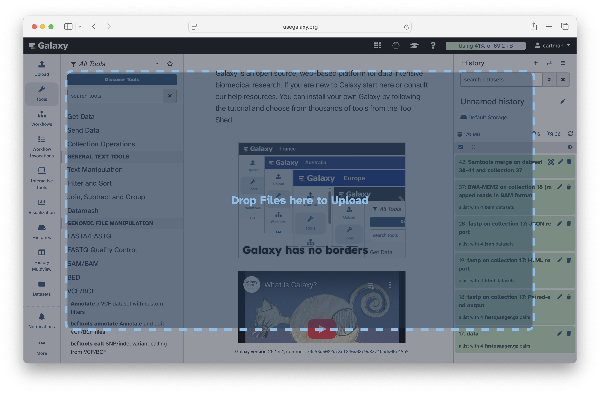
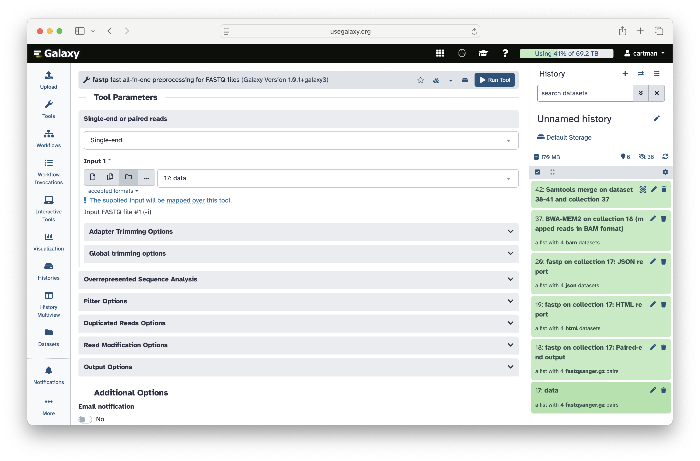
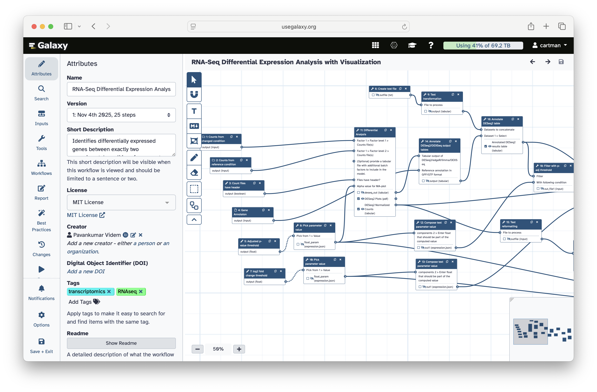
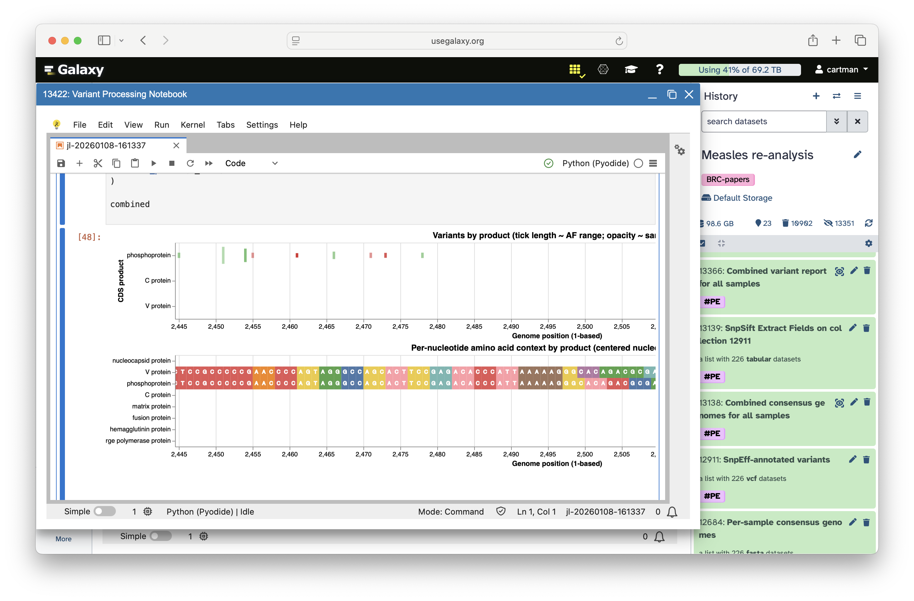
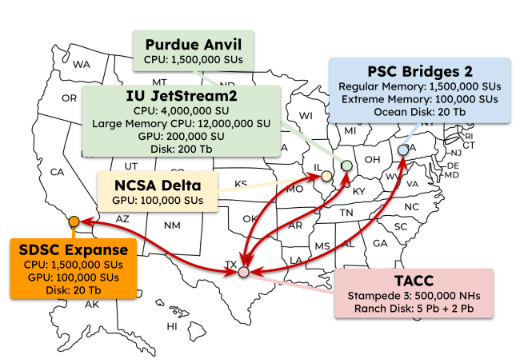
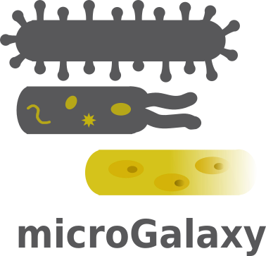
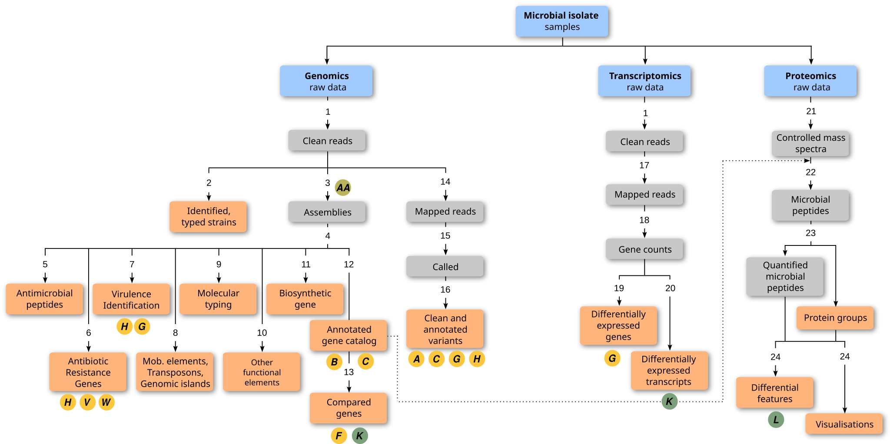
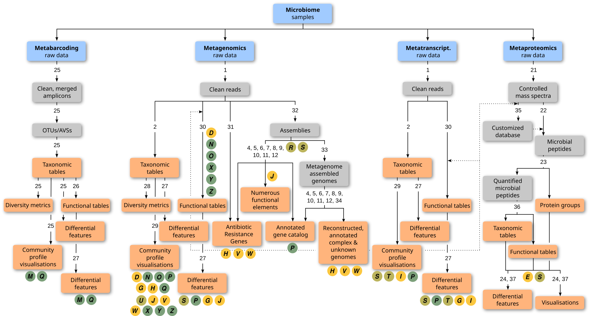
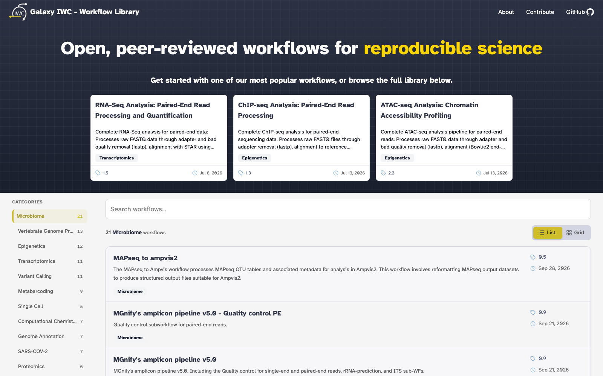
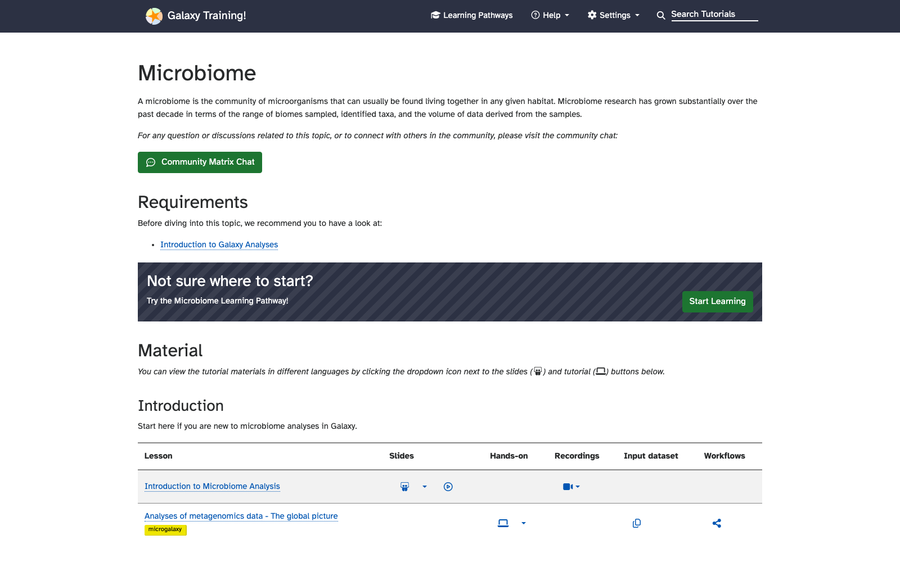

# [intro] Galaxy is free, it is powerful and it scales!
> Analyze microbial genomes, microbiomes, and multi-omics data in one place, no command line required.

| Stat | Label |
|------|-------|
| 750,000 | jobs per month |
| 400,000+ | registered users |
| 1,500 | concurrent users |
| $2,000,000+ | free compute / year |
| 10,000+ | analysis tools |
| 22,000+ | citations |

---

# [intro] Get your data!
> From your computer, the web, SRA, ENA, anywhere

---

# [intro] Run a tool ...
> Shovill, Bakta, AMRFinderPlus, QIIME 2, MetaPhlAn and 1,000s more

---

# [intro] ... or run a workflow!
> Select from 100s of community-curated workflows, 115+ built for microbiology

---

# [intro] Interpret and publish!
> Integrated Jupyter, RStudio, Krona, Pavian, Phinch and more

---

# [intro] Galaxy is Highly Scalable
> split

Galaxy provides an equivalent of **>$2,000,000/year** of free computational infrastructure to all biomedical researchers in the US.

Powered by ACCESS-CI, Galaxy accesses resources at **TACC, PSC, NCSA, and SDSC** to deliver unprecedented scale: assemble hundreds of isolates or bin a deep metagenome without owning a cluster.

::: highlight
Every new Galaxy user automatically gets 250 GB of permanent storage and 1 TB of scratch space with 8 concurrent job slots.
:::

---

# [micro] microGalaxy: a community for microbial data analysis
> split

Since **2021**, the microGalaxy community has brought together users, developers, trainers, and bioinformaticians working on microbial data in Galaxy.

Together they curate tools and workflows, write training, and standardize **FAIR** best practices for metabarcoding, (meta)genomics, (meta)transcriptomics, (meta)proteomics, and bacterial isolate analysis.

::: highlight
Everyone is welcome: four online meetings a year, a Matrix chat room, hackathons, and a dedicated track at the Galaxy Community Conference.
:::

---

# [micro] The Microbiology Galaxy Lab
> A curated Galaxy entry point for microbiologists, built and maintained by the microGalaxy community

| Stat | Label |
|------|-------|
| 315+ | curated tool suites |
| 115+ | curated workflows |
| 170+ | reference genomes |
| 11 TB | reference data |
| 40+ | training tutorials |
| 4 | public servers: US, EU, AU, FR |

---

# [micro] From bacterial isolates to answers
> split

**Assemble** with Shovill, SPAdes, Flye or Unicycler; **annotate** with Bakta or Prokka; call variants with Snippy or Clair3.

**Detect antimicrobial resistance** with AMRFinderPlus, CARD/RGI, ResFinder and ABRicate; type strains with MLST and cgMLST; build pangenomes with PPanGGOLiN; mine biosynthetic gene clusters with antiSMASH.

::: highlight
Genomics, transcriptomics and proteomics of microbial isolates in one reproducible environment.
:::

---

# [micro] Microbiome analysis at any scale
> split: reverse

**Metabarcoding:** QIIME 2, DADA2, mothur, LotuS2 and the MGnify amplicon pipeline for 16S, ITS and 18S data.

**Shotgun metagenomics:** Kraken2, MetaPhlAn, HUMAnN, MEGAHIT, metaSPAdes, SemiBin, CheckM, GTDB-Tk and dRep for taxonomic and functional profiling and MAG generation.

::: highlight
Metatranscriptomics and metaproteomics too, with visualization in Krona, Pavian, Phinch and phyloseq.
:::

---

# [workflows] A universe of microbial applications
> type: wordcloud
> Tools, workflows and tutorials for every corner of the microbial sciences

- [16S Amplicon](https://iwc.galaxyproject.org/?filter=Metabarcoding)
- [Shotgun Metagenomics](https://training.galaxyproject.org/training-material/topics/microbiome/)
- [MAG Assembly](https://iwc.galaxyproject.org/?filter=Microbiome)
- [AMR Detection](https://iwc.galaxyproject.org/?filter=Genome%20Annotation)
- [Pathogen Detection](https://iwc.galaxyproject.org/?filter=Microbiome)
- [Outbreak Surveillance](https://training.galaxyproject.org/training-material/topics/microbiome/)
- [Bacterial Assembly](https://iwc.galaxyproject.org/?filter=Genome%20assembly)
- [Genome Annotation](https://iwc.galaxyproject.org/?filter=Genome%20Annotation)
- [cgMLST Typing](https://iwc.galaxyproject.org/?filter=Bacterial%20Genomics)
- [Pangenomics](https://training.galaxyproject.org/training-material/topics/genome-annotation/)
- [Biosynthetic Gene Clusters](https://training.galaxyproject.org/training-material/topics/genome-annotation/)
- [Metatranscriptomics](https://training.galaxyproject.org/training-material/topics/microbiome/)
- [Metaproteomics](https://iwc.galaxyproject.org/?filter=Metaproteomics)
- [Viral Genomics](https://iwc.galaxyproject.org/?filter=Virology)
- [SARS-CoV-2](https://iwc.galaxyproject.org/?filter=SARS-COV-2)
- [Influenza Subtyping](https://iwc.galaxyproject.org/?filter=Virology)
- [Taxonomic Profiling](https://iwc.galaxyproject.org/?filter=Microbiome)
- [Diversity Analysis](https://training.galaxyproject.org/training-material/topics/microbiome/)
- [Host Read Removal](https://iwc.galaxyproject.org/?filter=Metagenomics)
- [Nanopore](https://training.galaxyproject.org/training-material/topics/microbiome/)
- [Tuberculosis](https://training.galaxyproject.org/training-material/topics/variant-analysis/)
- [One Health](https://training.galaxyproject.org/training-material/topics/one-health/)
- [Food Safety](https://training.galaxyproject.org/training-material/topics/microbiome/)
- [Clinical Metaproteomics](https://iwc.galaxyproject.org/?filter=Proteomics)
- [Comparative Genomics](https://iwc.galaxyproject.org/?filter=Comparative%20Genomics)
- [Variant Calling](https://iwc.galaxyproject.org/?filter=Variant%20Calling)
- [Microbial Ecology](https://training.galaxyproject.org/training-material/topics/ecology/)
- [Multi-omics](https://training.galaxyproject.org/training-material/topics/microbiome/)
- [Visualization](https://training.galaxyproject.org/training-material/topics/visualisation/)

---

# [workflows] Open, peer-reviewed workflows
> 20+ microbiome workflows plus metabarcoding, metagenomics, AMR, virology and bacterial genomics collections at iwc.galaxyproject.org

---

# [workflows] Flagship microbial workflows
> stats: lists

| Stat | Label |
|------|-------|
| MAG Generation | Reads to quality-checked MAGs |
| AMR Detection | Assemblies to resistance gene reports |
| PathoGFAIR | Nanopore reads to pathogen reports |
| QIIME 2 Amplicon | 16S reads to ASV tables and diversity |
| Isolate Assembly | Illumina reads to Shovill + Bakta genome |

---

# [workflows] Galaxy in the microbial sciences
> Peer-reviewed publications using Galaxy for microbiology, through December 2025

| Stat | Label |
|------|-------|
| 2,908 | microbiology publications |
| 836 | health & disease studies |
| 593 | ecosystem & biodiversity studies |
| 30+ | microbial training events |

---

# [workflows] Powering platforms you may already know
> type: text

**BRC Analytics**: NIAID pathogen genomics platform built on Galaxy

**IRIDA**: Canada's Integrated Rapid Infectious Disease Analysis platform

**ABRomics**: the French national multi-omics antimicrobial resistance platform

**Galaxy-P**: metaproteomics and clinical microbiome proteomics

**PathoGFAIR**: FAIR pathogen detection and outbreak tracking

---

# [community] Learn microbial data analysis for free
> split: reverse

The Galaxy Training Network offers **40+ hands-on microbiology tutorials**, 15 videos and 3 structured learning pathways, all free, open and peer-reviewed.

Start with the **Microbiome Learning Pathway**, or jump straight to tutorials on 16S analysis, MAG building, pathogen detection, AMR, and clinical metaproteomics.

::: highlight
Every tutorial runs on the public servers with ready-to-use example data: training.galaxyproject.org
:::

---

# [community] Global Microbiology Galaxy Labs
> type: galaxies
> background: images/galaxies.svg

Free, public Galaxy servers with a microbiology-focused interface on three continents

**microbiology.usegalaxy.org** (USA), **microbiology.usegalaxy.eu** (Europe), **microbiology.usegalaxy.org.au** (Australia) and **microbiology.usegalaxy.fr** (France) share the same curated tool panel, workflows and reference data. Histories, jobs and quota are shared with the main server, so you can switch between the Lab and full Galaxy at any time.

---

# [community] Key links
> type: links
> Everything microbial in Galaxy

- Microbiology Lab (US): https://microbiology.usegalaxy.org
- Microbiology Lab (EU): https://microbiology.usegalaxy.eu
- microGalaxy SIG: https://galaxyproject.org/community/sig/microbial/
- Workflows: https://iwc.galaxyproject.org
- Training: https://training.galaxyproject.org/training-material/topics/microbiome/
- Chat: https://matrix.to/#/#galaxyproject_microGalaxy:gitter.im
- Hub: https://galaxyproject.org
- GitHub: https://github.com/galaxyproject

---

# [community] Join the microGalaxy community
> type: qr
> galaxyproject.org/community/sig/microbial

---

# [community] Try the Microbiology Lab
> type: qr
> microbiology.usegalaxy.org

