# [intro] Galaxy Workshop
> Michael Schatz, Anton Nekrutenko, Delphine Lariviere, Mentewab Ayalew, Skyy Lewis, Nonie Shuford, Michelle Savage

---

# [intro] Agenda
> stats: lists

| Stat | Label |
|------|-------|
| Intro to Galaxy | Michael Schatz, Anton Nekrutenko |
| Genome Assembly | Delphine Lariviere |
| Microbiome Research | Mentewab Ayalew, Skyy Lewis, Nonie Shuford |
| Machine Learning | Michelle Savage |

---

# [galaxy] Galaxy is a Universe

---

# [galaxy] Galaxy is free, it is powerful and it scales!
> Analyze your genomic, metagenomic, proteomic, metabolomic data in one place.

| Stat | Label |
|------|-------|
| 750,000 | jobs per month |
| 400,000+ | registered users |
| 1,500 | concurrent users |
| $2,000,000+ | free compute / year |
| 10,000+ | analysis tools |
| 22,000+ | citations |

---

# [galaxy] Galaxy = 1,000s of tools
> Galaxy serves thousands of open-source analysis tools and is tightly integrated with BioConda and BioContainers communities

| Stat | Label |
|------|-------|
| 11,699 | BioConda packages |
| 30,722 | CondaForge packages |
| 12,333 | BioContainers |
| 10,676 | Galaxy wrappers |

---

# [galaxy] Galaxy = 1,000s of tools
> All tools have a consistent interface

---

# [galaxy] Galaxy = 100s of workflows
> Community-curated, production-ready

---

# [galaxy] Galaxy = 100s of workflows
> type: wordcloud
> Community-curated, production-ready

- [Amplicon](https://iwc.galaxyproject.org/?filter=Amplicon)
- [Bacterial Genomics](https://iwc.galaxyproject.org/?filter=Bacterial%20Genomics)
- [Epigenetics](https://iwc.galaxyproject.org/?filter=Epigenetics)
- [Genome Assembly](https://iwc.galaxyproject.org/?filter=Genome%20Assembly)
- [Genome Annotation](https://iwc.galaxyproject.org/?filter=Genome%20Annotation)
- [Imaging](https://iwc.galaxyproject.org/?filter=Imaging)
- [Metabolomics](https://iwc.galaxyproject.org/?filter=Metabolomics)
- [Microbiome](https://iwc.galaxyproject.org/?filter=Microbiome)
- [Proteomics](https://iwc.galaxyproject.org/?filter=Proteomics)
- [Single Cell](https://iwc.galaxyproject.org/?filter=Single%20Cell)
- [Transcriptomics](https://iwc.galaxyproject.org/?filter=Transcriptomics)
- [Variant Calling](https://iwc.galaxyproject.org/?filter=Variant%20Calling)
- [Virology](https://iwc.galaxyproject.org/?filter=Virology)
- [VGP](https://iwc.galaxyproject.org/?filter=VGP)

---

# [galaxy] Ways to use Galaxy
> GUI, API, LLMs (soon!)

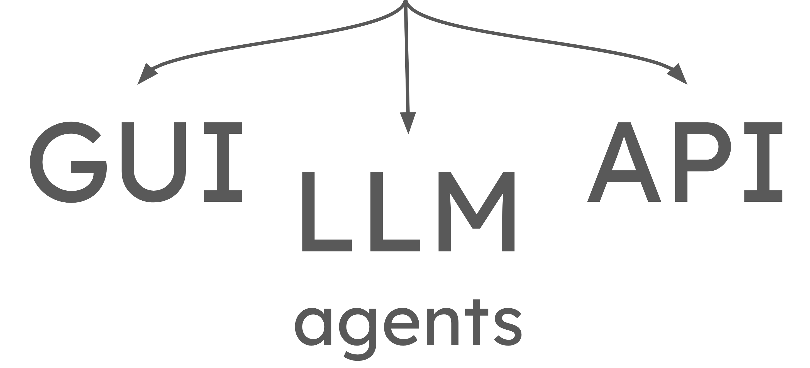

---

# [galaxy] Run programmatically
> Against our infrastructure!

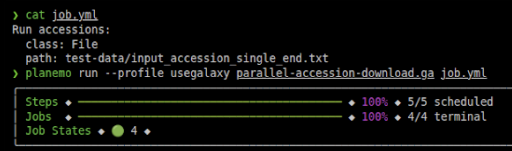

---

# [galaxy] Globally distributed
> Use the one closer to you!

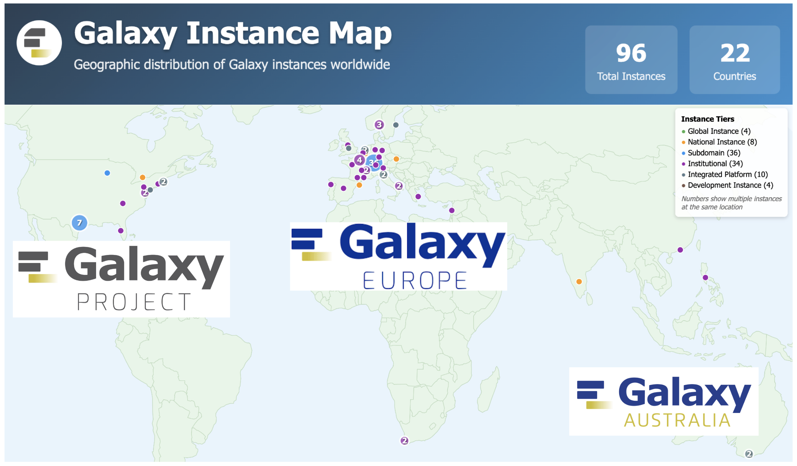

---

# [projects] Part of large initiatives
> type: ecosystem

## AnVIL

NHGRI cloud platform

## BRC-Analytics

Pathogen bioinformatics

## CFDE

Common Fund Data Ecosystem

## VGP
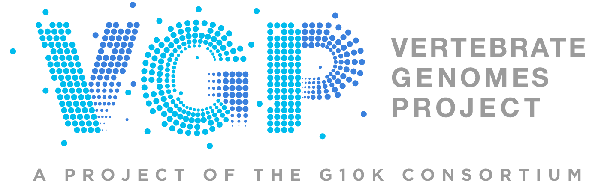
Vertebrate Genomes Project

---

# [projects] AnVIL
> NHGRI's Analysis, Visualization, and Informatics Lab-Space

---

# [projects] BRC Analytics
> type: sunburst
> Pathogen bioinformatics powered by Galaxy

---

# [projects] CFDE Cloud Workspace
> Tools for analyses of protected datasets

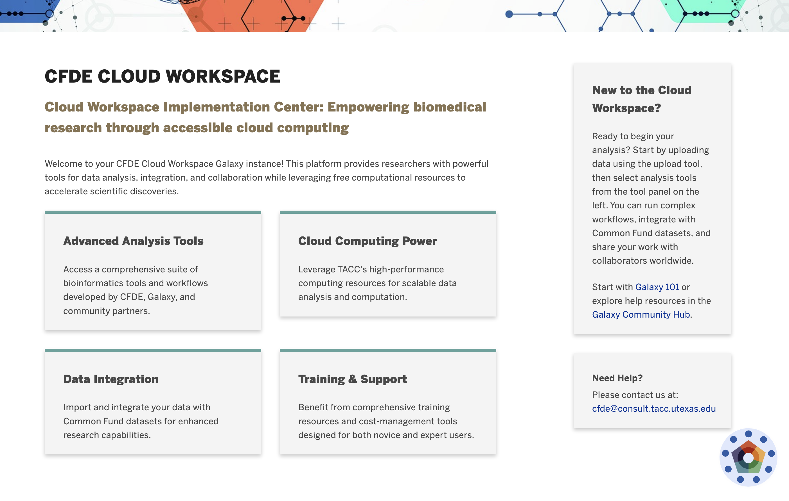

---

# [projects] VGP: Sequencing Vertebrate Diversity
> type: imagegrid
> grid: large
> 600 assemblies and counting

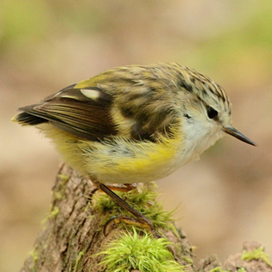

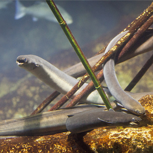
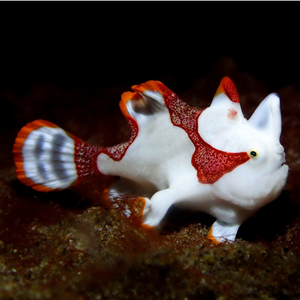
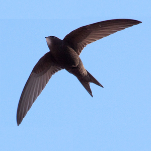

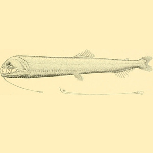

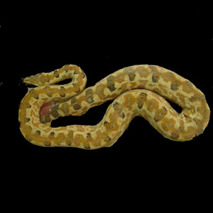

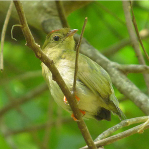

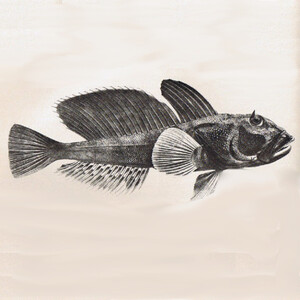
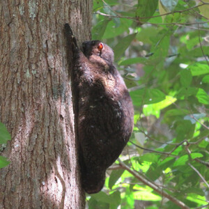

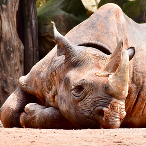
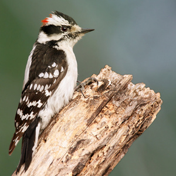

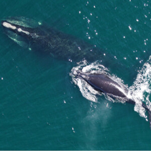

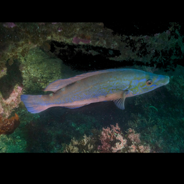

---

# [community] Wide variety of training topics
> type: wordcloud
> https://training.galaxyproject.org

- [Genomics](https://training.galaxyproject.org/training-material/topics/genome-annotation/)
- [Transcriptomics](https://training.galaxyproject.org/training-material/topics/transcriptomics/)
- [Proteomics](https://training.galaxyproject.org/training-material/topics/proteomics/)
- [Metabolomics](https://training.galaxyproject.org/training-material/topics/metabolomics/)
- [Single Cell](https://training.galaxyproject.org/training-material/topics/single-cell/)
- [Variant Analysis](https://training.galaxyproject.org/training-material/topics/variant-analysis/)
- [Sequence Analysis](https://training.galaxyproject.org/training-material/topics/sequence-analysis/)
- [Assembly](https://training.galaxyproject.org/training-material/topics/assembly/)
- [Epigenetics](https://training.galaxyproject.org/training-material/topics/epigenetics/)
- [Microbiome](https://training.galaxyproject.org/training-material/topics/microbiome/)
- [Machine Learning](https://training.galaxyproject.org/training-material/topics/statistics/)
- [Imaging](https://training.galaxyproject.org/training-material/topics/imaging/)
- [Climate](https://training.galaxyproject.org/training-material/topics/climate/)
- [Ecology](https://training.galaxyproject.org/training-material/topics/ecology/)
- [Evolution](https://training.galaxyproject.org/training-material/topics/evolution/)
- [SARS-CoV-2](https://training.galaxyproject.org/training-material/topics/variant-analysis/)
- [FAIR Data](https://training.galaxyproject.org/training-material/topics/fair/)
- [Visualization](https://training.galaxyproject.org/training-material/topics/visualisation/)
- [Computational Chemistry](https://training.galaxyproject.org/training-material/topics/computational-chemistry/)
- [Materials Science](https://training.galaxyproject.org/training-material/topics/materials-science/)
- [One Health](https://training.galaxyproject.org/training-material/topics/one-health/)
- [Plants](https://training.galaxyproject.org/training-material/topics/plants/)
- [Synthetic Biology](https://training.galaxyproject.org/training-material/topics/synthetic-biology/)
- [Data Science](https://training.galaxyproject.org/training-material/topics/data-science/)
- [Annotation](https://training.galaxyproject.org/training-material/topics/genome-annotation/)
- [RNA-seq](https://training.galaxyproject.org/training-material/topics/transcriptomics/)
- [ChIP-seq](https://training.galaxyproject.org/training-material/topics/epigenetics/)
- [ATAC-seq](https://training.galaxyproject.org/training-material/topics/epigenetics/)
- [Metagenomics](https://training.galaxyproject.org/training-material/topics/metagenomics/)

---

# [community] 2026 Galaxy Community Conference (GCC2026)
> June 22-24, 2026 | Clermont-Ferrand, France

---

# [community] Galaxy Training Academy 2026
> May 18-22, 2026 | Global Online Event

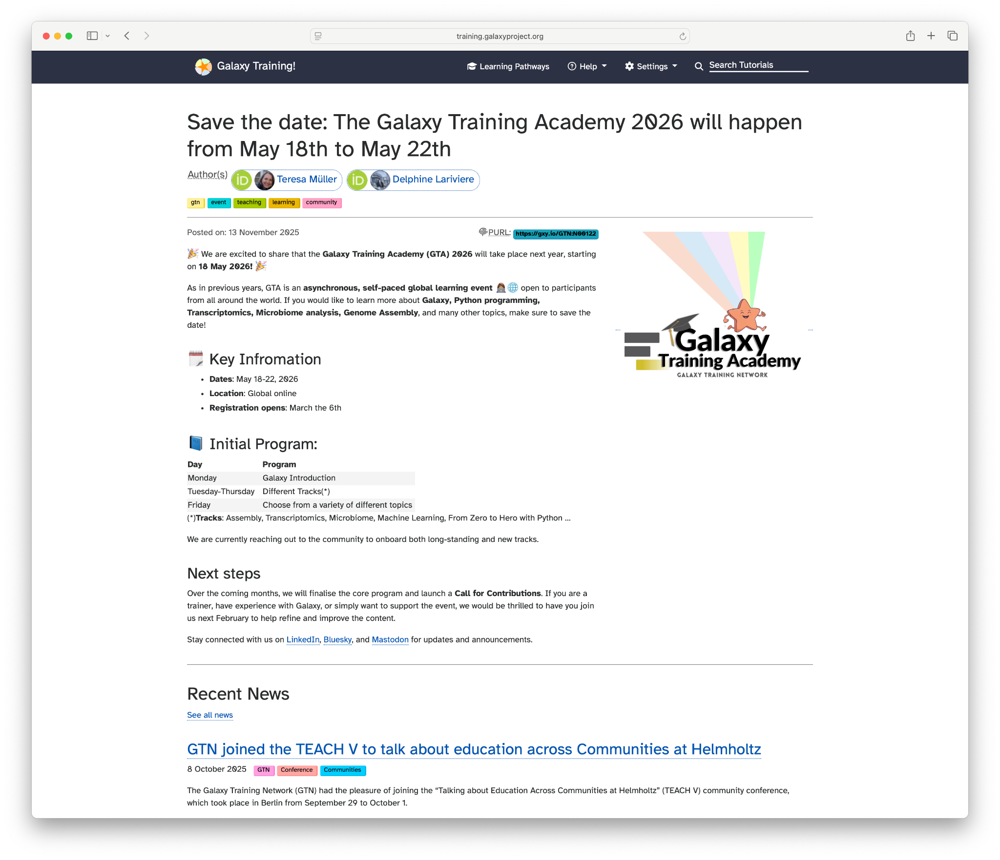

---

# [community] Galaxy is a community!
> type: imagegrid
> Contributors from Galaxy, GTN, and Tools-IUC

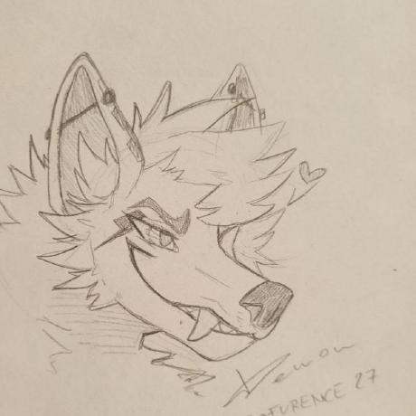

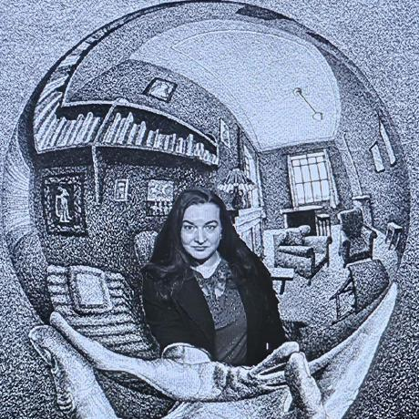
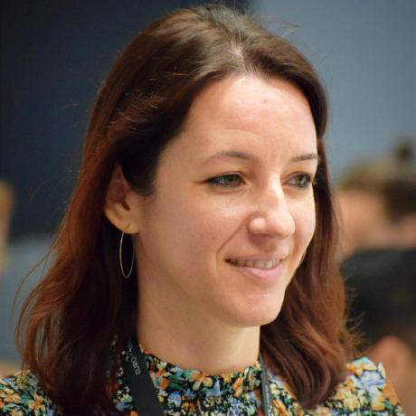

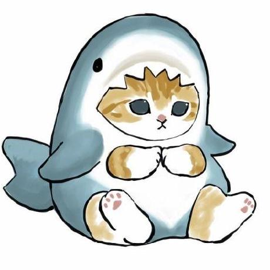

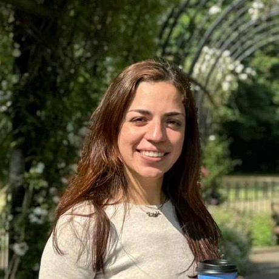

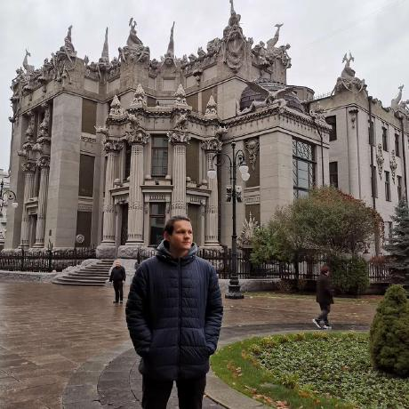

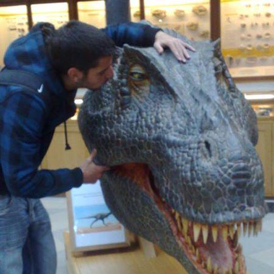

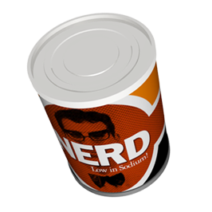

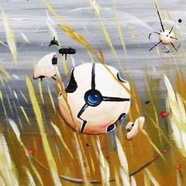

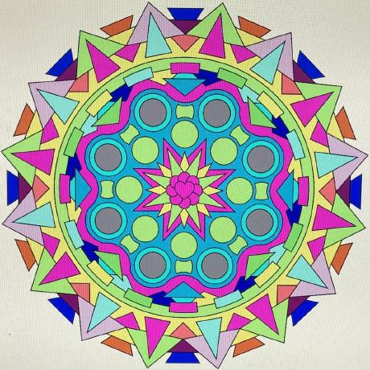

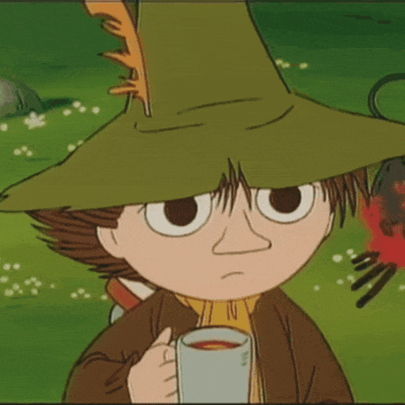

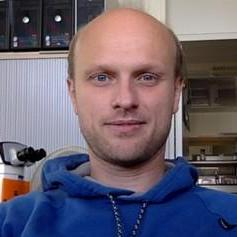

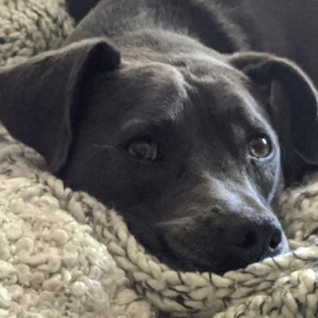

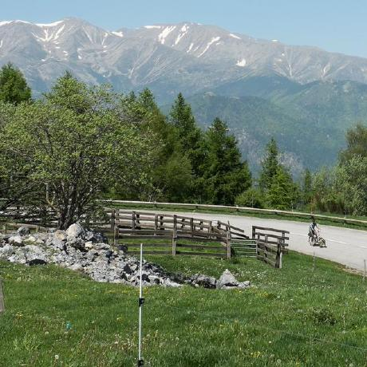

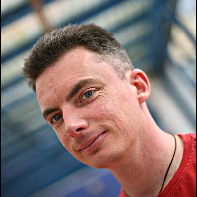

---

# [community] gxy.io/pag-2026
> type: qr

