# [overview] Sequencing Vertebrate Diversity
> type: imagegrid
> 50 species from the VGP assembly catalog

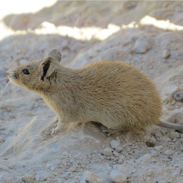

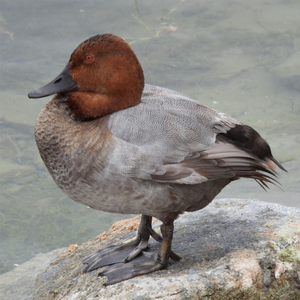

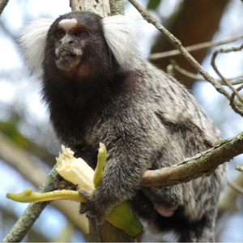

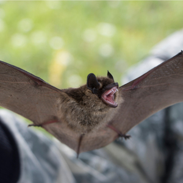

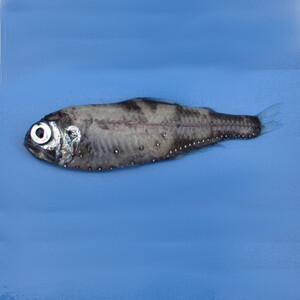
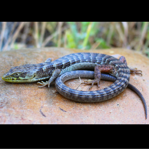

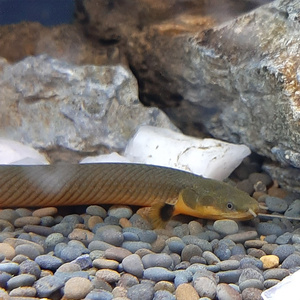

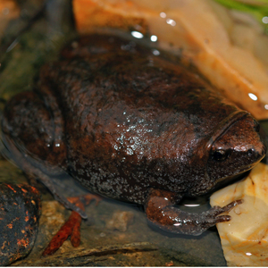
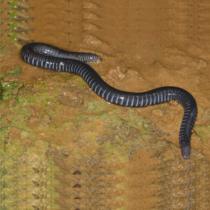

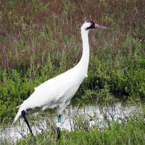

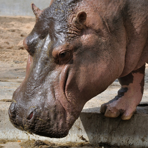

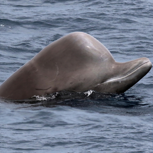

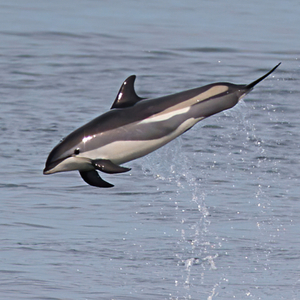

---

# [overview] Building the Tree of Life
> split

The Vertebrate Genomes Project (VGP) aims to generate near error-free, chromosome-level reference genome assemblies for all ~70,000 extant vertebrate species.

Galaxy provides the computational infrastructure to achieve this at scale, with standardized, reproducible workflows accessible to researchers worldwide.

::: highlight
"95% of the main discoveries that have driven biotechnology came from studying things that were not model organisms at the time." - Giulio Formenti
:::

---

# [overview] 274 genomes and counting
> type: scatter

---

# [pipeline] VGP Workflow Modules
> type: image-click

---

# [pipeline] Pre-Assembly & Assembly
> type: workflow

- VGP0 Mitogenome Assembly | HiFi reads, Species name, Genetic code | GenBank file, Annotation images
- VGP1 K-mer Profiling | HiFi reads, K-mer length, Ploidy | Meryl database, GenomeScope plots
- VGP2 K-mer Profiling Trio | HiFi reads, Parental Illumina | Meryl DBs, GenomeScope profiles
- VGP3 HiFi Assembly | HiFi reads, Meryl DB, GenomeScope | Primary assembly, Alternate assembly
- VGP4 HiFi+HiC Assembly | HiFi reads, HiC reads, Meryl DB | Haplotype 1, Haplotype 2
- VGP5 Trio Assembly | HiFi reads, Parental reads, Meryl DBs | Paternal haplotype, Maternal haplotype

---

# [pipeline] Post-Assembly Processing
> type: workflow

- VGP6 Purge Duplicates | Assemblies, Trimmed HiFi, Meryl DB | Purged primary, Purged alternate
- VGP6b Purge Single | Assembly, Trimmed HiFi, Meryl DB | Purged assembly
- VGP7 Bionano Scaffolding | Assembly (GFA), Bionano cmap | Scaffolds, QC plots
- VGP8 HiC Scaffolding | Assembly (GFA), HiC reads | Scaffolded assembly, Contact map

---

# [scale] VGP Workflows by Compute
> type: barchart
> data: workflow-hours.json
> Core hours used by workflows

---

# [scale] Top Assembly Tools
> type: barchart
> data: tool-hours.json
> Core hours used by individual tools

---

# [scale] Peak Memory by Tool
> type: barchart
> data: tool-memory.json
> Assembly needs memory!

---

# [scale] Powered by Galaxy + ACCESS-CI
> split: reverse

VGP leverages the US national cyberinfrastructure through ACCESS-CI, running on resources at TACC (Jetstream2), PSC, NCSA, and SDSC.

This provides the massive memory (up to 4TB) and CPU resources (up to 128 cores) needed for large vertebrate genome assemblies.

::: highlight
Galaxy provides an equivalent of >$2,000,000/year of free computational infrastructure to genomics researchers.
:::

---

# [resources] Key VGP Resources
> type: links

- VGP Galaxy: https://vgp.usegalaxy.org
- GenomeArk: https://genomeark2.org
- VGP Website: https://vertebrategenomesproject.org
- Galaxy US: https://usegalaxy.org

---

# [resources] gxy.io/what-is-vgp
> type: qr

