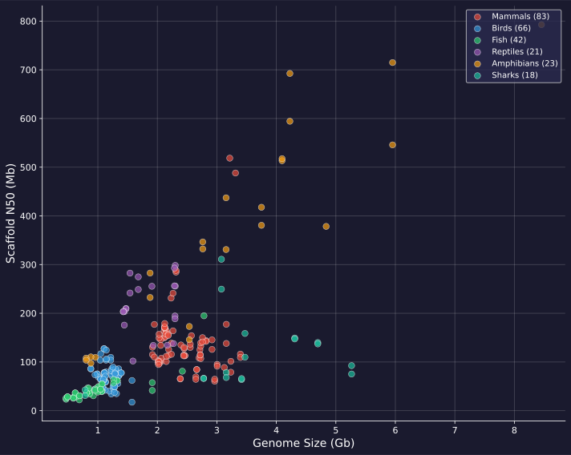

# [overview] Vertebrate Genomes Project on Galaxy
> Building reference-quality genomes for all 70,000 vertebrate species

| Stat | Label |
|------|-------|
| 2,330 | workflow runs |
| 461,000+ | core-hours |
| 113 | unique pipelines |
| 3+ | years of operation |

---

# [overview] Genome Assemblies: Size vs Quality
> split

257 reference-quality genome assemblies spanning genome sizes from 0.4 to 8.5 Gb.

Scaffold N50 values range from 17 to 793 Mb, demonstrating chromosome-level assembly quality across diverse vertebrate lineages.

::: highlight
Assemblies span mammals, birds, fish, reptiles, amphibians, and sharks.
:::

---

# [overview] Building the Tree of Life
> split

The Vertebrate Genomes Project (VGP) aims to generate near error-free, chromosome-level reference genome assemblies for all ~70,000 extant vertebrate species.

Galaxy provides the computational infrastructure to achieve this at scale, with standardized, reproducible workflows accessible to researchers worldwide.

::: highlight
"95% of the main discoveries that have driven biotechnology came from studying things that were not model organisms at the time." - Giulio Formenti
:::

---

# [pipeline] End-to-End Assembly Pipeline
> split: reverse

The VGP pipeline consists of 10 modular workflows organized into 5 stages, from raw data to chromosome-level assembly.

Each stage is designed to work with different data types: HiFi, Hi-C, Bionano, and parental Illumina for trio assemblies.

::: highlight
Workflows 1-9 cover the main assembly pipeline, with Workflow 0 dedicated to mitochondrial genome assembly.
:::

---

# [pipeline] VGP Assembly Workflows
> type: wordcloud

- [K-mer Profiling Solo](https://usegalaxy.org)
- [K-mer Profiling Trio](https://usegalaxy.org)
- [Contiging Solo](https://usegalaxy.org)
- [Contiging Solo w/HiC](https://usegalaxy.org)
- [Contiging Trio](https://usegalaxy.org)
- [Purging](https://usegalaxy.org)
- [Scaffolding BioNano](https://usegalaxy.org)
- [Scaffolding HiC](https://usegalaxy.org)
- [Decontamination](https://usegalaxy.org)
- [Mitogenome Assembly](https://usegalaxy.org)
- [PretextMap Generation](https://usegalaxy.org)
- [BUSCO Analysis](https://usegalaxy.org)
- [Merqury QC](https://usegalaxy.org)
- [GfaStats](https://usegalaxy.org)
- [Hifiasm](https://usegalaxy.org)
- [Salsa/YAHS](https://usegalaxy.org)
- [Genomescope](https://usegalaxy.org)
- [Purge Dups](https://usegalaxy.org)

---

# [scale] Massive Computational Scale
> Compute resources used by VGP on Galaxy

| Stat | Label |
|------|-------|
| 24,500+ | hours of runtime |
| 40,600+ | jobs executed |
| 4 TB | peak memory per job |
| 128 | max cores per job |

---

# [scale] 3 Years of Genome Assembly
> split

From July 2022 to October 2025, the VGP has continuously used Galaxy to assemble vertebrate genomes.

The top workflows by execution count include Hi-C scaffolding (244 runs), PretextMap generation (210 runs), and decontamination (131 runs).

::: highlight
77.9% of all workflow runs completed successfully, with the remainder either cancelled or requiring troubleshooting.
:::

---

# [scale] Powered by Galaxy + ACCESS-CI
> split: reverse

VGP leverages the US national cyberinfrastructure through ACCESS-CI, running on resources at TACC (Jetstream2), PSC, NCSA, and SDSC.

This provides the massive memory (up to 4TB) and CPU resources (up to 128 cores) needed for large vertebrate genome assemblies.

::: highlight
Galaxy provides an equivalent of >$2,000,000/year of free computational infrastructure to genomics researchers.
:::

---

# [resources] Key VGP Resources
> type: links

- VGP Galaxy: https://vgp.usegalaxy.org
- GenomeArk: https://genomeark.org
- VGP Website: https://vertebrategenomesproject.org
- Galaxy US: https://usegalaxy.org
- IWC Workflows: https://iwc.galaxyproject.org
- GTN Assembly Training: https://training.galaxyproject.org/training-material/topics/assembly/

---

# [resources] vgp.usegalaxy.org
> type: qr

