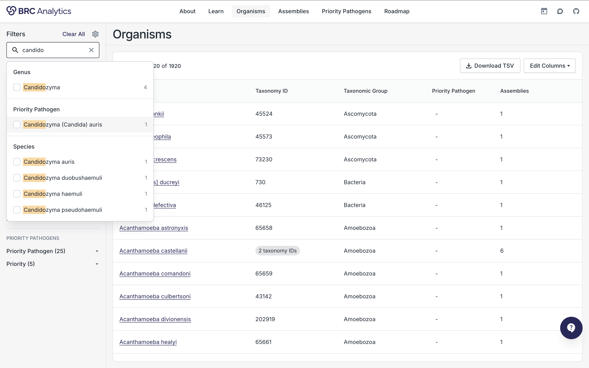
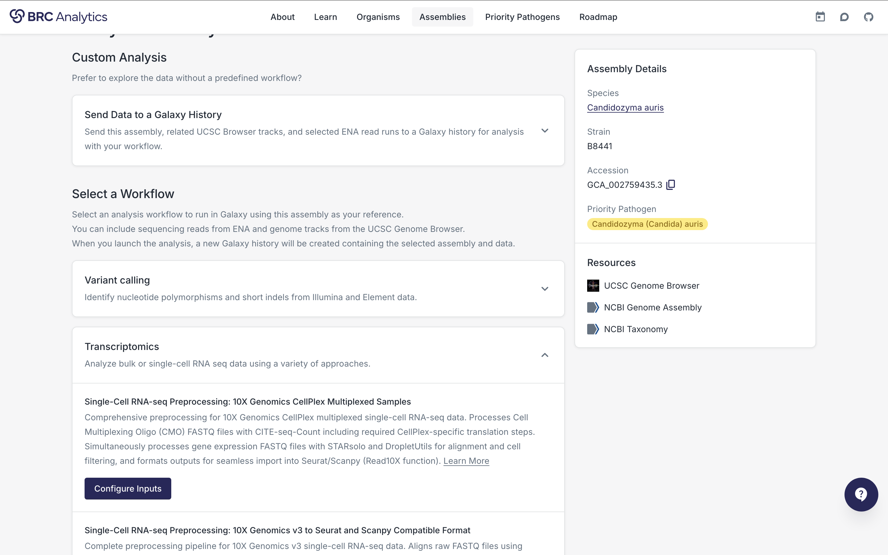

---
masthead:
  - name: "1-2-3"
    section: intro
  - name: "Platform"
    section: platform
  - name: "Capabilities"
    section: capabilities
  - name: "Resources"
    section: resources
---

# [platform] BRC Analytics

> From raw reads to publication-ready results in your browser

| Stat | Label |
|------|-------|
| 5,060 | genome assemblies |
| 1,920 | pathogen taxa |
| 26+ | priority pathogens |
| FREE | cloud compute |

---

# [intro] Find organism

> Select from 1,920 taxa (ultimately all NCBI Datasets species)

---

# [intro] Select genome

> Select from 5,060 genome assemblies

---

# [intro] Select workflow

> Select from a growing number of best-practice workflows

---

# [intro] Select data

> Select anything from entire SRA or upload your own

---

# [intro] Run workflow

> One one sample of 1,000,000 samples

---

# [intro] Interpret!

> Analyze and publish

---

# [platform] Best data source in one package

> split

Battle tested resources and infrastructure

---

# [platform] Cloud-Powered Infrastructure

> split

Hosted at Texas Advanced Computing Center with funding from ACCESS-CI. No installation required - just open your browser and start analyzing.

::: highlight
Free compute for researchers
:::

---

# [capabilities] Pathogen Taxonomy Browser

> type: sunburst

> 1,920 pathogen taxa across bacteria, viruses, and fungi

---

# [capabilities] Analysis Workflows

> Validated pipelines for pathogen genomics

| Stat | Label |
|------|-------|
| Variant | Calling |
| RNA-seq | Transcriptomics |
| Assembly | Genome construction |
| Consensus | Sequence generation |

---

# [resources] Key Links

> type: links
> Essential resources for BRC Analytics

- BRC Analytics: https://brc-analytics.org
- BV-BRC: https://www.bv-brc.org
- Galaxy: https://usegalaxy.org
- IWC Workflows: https://iwc.galaxyproject.org
- GitHub: https://github.com/galaxyproject/brc-analytics

---

# [resources] Get Started

> type: qr

