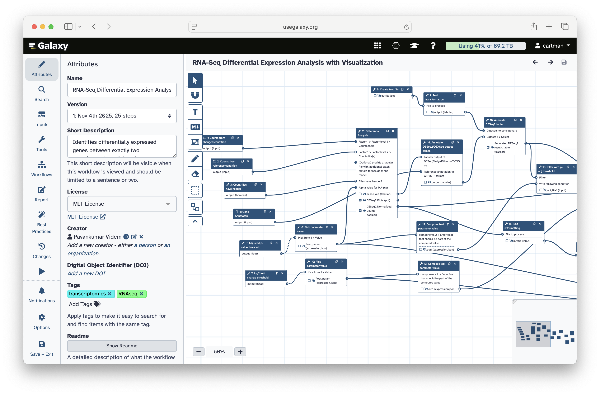

# [global] Galaxy is free, it is powerful and it scales!
> Analyze your genomic, metagenomic, proteomic, metabolomic data in one place.

| Stat | Label |
|------|-------|
| 750,000 | jobs per month |
| 400,000+ | registered users |
| 1,500 | concurrent users |
| $2,000,000+ | free compute / year |
| 10,000+ | analysis tools |
| 22,000+ | citations |

---

# [intro] Get your data!
> From computer, web, SRA, anywhere

---

# [intro] Run a tool ...
> Select from 1,000s of tools

---

# [intro] ... or run a workflow!
> Select from 100s of community curated workflows

---

# [intro] Interpret and publish!
> Use integrated Jupyter or RStudio and soon new AI agentic tools

---

# [global] Galaxy is Highly Scalable
> split

Galaxy provides an equivalent of **>$2,000,000/year** of free computational infrastructure to all biomedical researchers in the US.

Powered by ACCESS-CI, Galaxy accesses resources at **TACC, PSC, NCSA, and SDSC** to deliver unprecedented scale.

::: highlight
Every new Galaxy user automatically gets 250 GB of permanent storage and 1 TB of scratch space with 8 concurrent job slots.
:::

---

# [global] Galaxy is a Tool Ecosystem
> Galaxy serves thousands of open source analysis tools and is tightly integrated with BioConda and BioContainer communities

| Stat | Label |
|------|-------|
| 11,699 | BioConda packages |
| 30,722 | CondaForge packages |
| 12,333 | BioContainers |
| 10,676 | Galaxy wrappers |

---

# [global] Galaxy is a Global Training Hub
> split: reverse

The Galaxy Training Network (GTN) provides free, open, and peer-reviewed training materials with **489 tutorials** across **35 topics**.

Galaxy powers the largest biological data analysis training events in the world, with **>3,700 simultaneous participants** in Galaxy Training Academy 2025.

::: highlight
214 training videos and 499 contributors make GTN the most comprehensive bioinformatics training resource available.
:::

---

# [capabilities] A Universe of Applications
> type: wordcloud

- [Genomics](https://training.galaxyproject.org/training-material/topics/genome-annotation/)
- [Transcriptomics](https://training.galaxyproject.org/training-material/topics/transcriptomics/)
- [Proteomics](https://training.galaxyproject.org/training-material/topics/proteomics/)
- [Metabolomics](https://training.galaxyproject.org/training-material/topics/metabolomics/)
- [Single Cell](https://training.galaxyproject.org/training-material/topics/single-cell/)
- [Variant Analysis](https://training.galaxyproject.org/training-material/topics/variant-analysis/)
- [Sequence Analysis](https://training.galaxyproject.org/training-material/topics/sequence-analysis/)
- [Assembly](https://training.galaxyproject.org/training-material/topics/assembly/)
- [Epigenetics](https://training.galaxyproject.org/training-material/topics/epigenetics/)
- [Microbiome](https://training.galaxyproject.org/training-material/topics/microbiome/)
- [Machine Learning](https://training.galaxyproject.org/training-material/topics/statistics/)
- [Imaging](https://training.galaxyproject.org/training-material/topics/imaging/)
- [Climate](https://training.galaxyproject.org/training-material/topics/climate/)
- [Ecology](https://training.galaxyproject.org/training-material/topics/ecology/)
- [Evolution](https://training.galaxyproject.org/training-material/topics/evolution/)
- [SARS-CoV-2](https://training.galaxyproject.org/training-material/topics/variant-analysis/)
- [FAIR Data](https://training.galaxyproject.org/training-material/topics/fair/)
- [Visualisation](https://training.galaxyproject.org/training-material/topics/visualisation/)
- [Computational Chemistry](https://training.galaxyproject.org/training-material/topics/computational-chemistry/)
- [Materials Science](https://training.galaxyproject.org/training-material/topics/materials-science/)
- [One Health](https://training.galaxyproject.org/training-material/topics/one-health/)
- [Plants](https://training.galaxyproject.org/training-material/topics/plants/)
- [Synthetic Biology](https://training.galaxyproject.org/training-material/topics/synthetic-biology/)
- [Data Science](https://training.galaxyproject.org/training-material/topics/data-science/)
- [Annotation](https://training.galaxyproject.org/training-material/topics/genome-annotation/)
- [RNA-seq](https://training.galaxyproject.org/training-material/topics/transcriptomics/)
- [ChIP-seq](https://training.galaxyproject.org/training-material/topics/epigenetics/)
- [ATAC-seq](https://training.galaxyproject.org/training-material/topics/epigenetics/)
- [Metagenomics](https://training.galaxyproject.org/training-material/topics/metagenomics/)

---

# [capabilities] Scalable Genome Assembly
> split

The Vertebrate Genomes Project has produced near error-free, chromosome-level genomes for **600 species** using Galaxy on Jetstream2.

VGP's ultimate goal: generating reproducible reference genomes for approximately **70,000** known living vertebrate species.

::: highlight
"95% of the main discoveries that have driven biotechnology came from studying things that were not model organisms at the time." — Giulio Formenti, Rockefeller University
:::

---

# [ecosystem] Global Galaxy Instances
> type: galaxies
> background: images/galaxies.svg

The usegalaxy.* consortium provides free, public Galaxy servers across three continents

**usegalaxy.org** (USA), **usegalaxy.eu** (Europe), and **usegalaxy.org.au** (Australia) form a global network of free, open-access Galaxy servers. Together they provide researchers worldwide with no-cost access to thousands of analysis tools, training resources, and petabytes of storage for reproducible computational biology research.

---

# [ecosystem] Galaxy Ecosystem
> type: ecosystem
> Tools and services powering the Galaxy platform

## Tools: IUC

Community-driven tool curation and best practices

## Workflows: IWC

Curated, tested, and published workflows

## BioContainers

100,000+ Docker and Singularity containers for robustness and reproducibility

## Planemo

Galaxy's SDK swiss knife

## Pulsar

Distributed job execution engine: Run Galaxy jobs on any computational resource from HPC to cloud

## TPV

Dynamic job routing system that knows where each tools needs to be run

---

# [ecosystem] galaxyproject.org
> type: links
> Key links

- US: https://usegalaxy.org
- VGP: https://vgp.usegalaxy.org
- EU: https://usegalaxy.eu
- AU: https://usegalaxy.org.au
- Hub: https://galaxyproject.org
- Training: https://training.galaxyproject.org
- IWC: https://iwc.galaxyproject.org
- GitHub: https://github.com/galaxyproject

---

# [ecosystem] Galaxy Workshop Tuesday!
> split

Come see the **Galaxy Workshop** on **Tuesday, Jan 13** at **4pm** in **Town and Country D**.

Learn hands-on how to use Galaxy for your research analysis needs.

::: highlight
Tuesday, Jan 13 - Town and Country D - 4:00 PM
:::

---

# [ecosystem] gxy.io/what-is-galaxy
> type: qr

